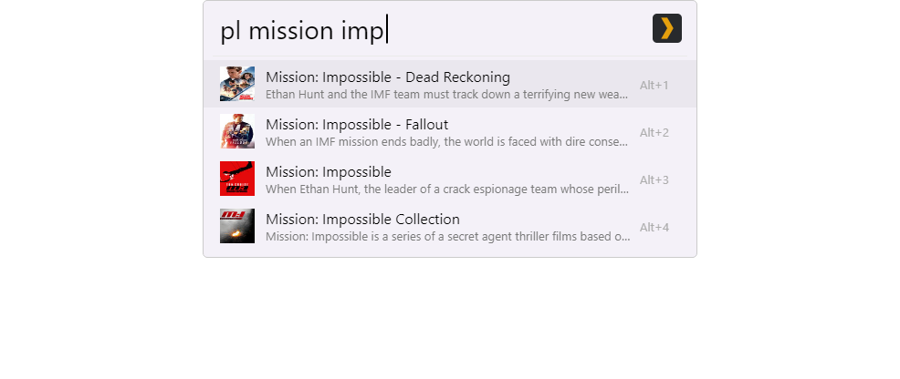
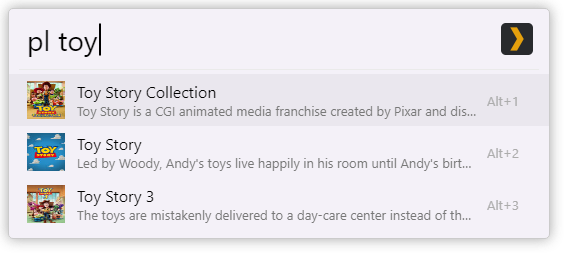
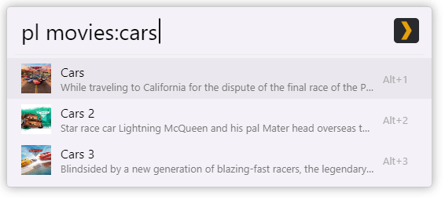
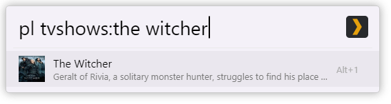
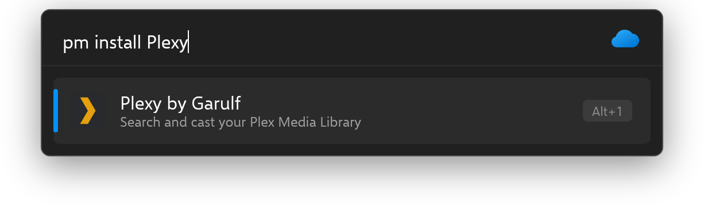

<!-- generated by readwright from docs/README.md.j2; edit the template, not this file -->


# Plexy

Search and cast your Plex library with Flow Launcher.

[](https://github.com/Garulf/Plexy/actions/workflows/release.yml) [](https://github.com/Garulf/Plexy/releases/latest)

[](https://www.buymeacoffee.com/garulf) [](https://github.com/sponsors/Garulf)

## Features

* **Search your whole library.** Movies, shows, episodes, music and collections from one search box.
* **Filter by library.** Prefix a search with a library name to search only that library.
* **On Deck.** An empty search lists what you're in the middle of watching.
* **Cast to any client.** Send media to any available Plex client from the context menu.
* **Track progress.** Mark items watched or unwatched without opening Plex.

## Usage

Type `pl` followed by a search term:

```
pl toy
```



To search a single library, type its name and a colon (`:`) before your search term. Spaces in the
library name are optional:

```
pl movies: cars 3
```



```
pl tvshows: the witcher
```



Selecting a result opens it in Plex Web. Open the context menu on a result (<kbd>Shift</kbd>+<kbd>Enter</kbd>)
to cast it to a Plex client, or to mark it watched or unwatched.

## Installation

### Flow Launcher

In Flow Launcher, type:

```
pm install plexy
```



### Manual installation

Download `Plexy-<version>.zip` from the [latest release](https://github.com/Garulf/Plexy/releases/latest) and unzip it into
`%appdata%\FlowLauncher\Plugins`, then restart Flow Launcher.

## Configuration

Set your server's details in Flow Launcher's settings under **Plugins → Plexy**. If Plexy can't connect,
selecting the error result opens the settings.

| Setting | Format |
| --- | --- |
| URL | Must include `http://` or `https://`, e.g. `http://127.0.0.1:32400` |
| Token | See Plex's guide on [finding your authentication token](https://support.plex.tv/articles/204059436-finding-an-authentication-token-x-plex-token/) |

## Changelog

### [3.0.0](https://github.com/Garulf/Plexy/releases/tag/v3.0.0) - 2026-10-02

- Switch to the python_v2 plugin runtime with pyflowlauncher (Wox is no longer supported)
- Update plexapi to 4.18.3
- Reuse the Plex connection between searches and download thumbnails in parallel
- Open the plugin settings from the connection error result
- Generate the README with readwright

### [2.0.0](https://github.com/Garulf/Plexy/releases/tag/v2.0.0) - 2022-09-08

- Fix Scoop Flow Launcher crashes

### [1.1.1](https://github.com/Garulf/Plexy/releases/tag/v1.1.1) - 2022-07-18

- Fix requests by @Garulf in https://github.com/Garulf/Plexy/pull/5

See [CHANGELOG.md](CHANGELOG.md) for the full history.
